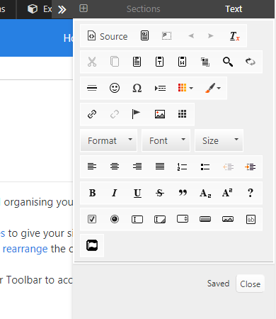
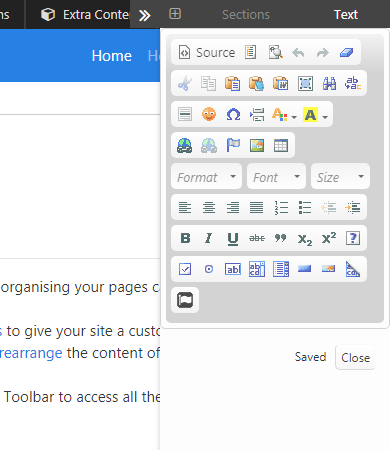
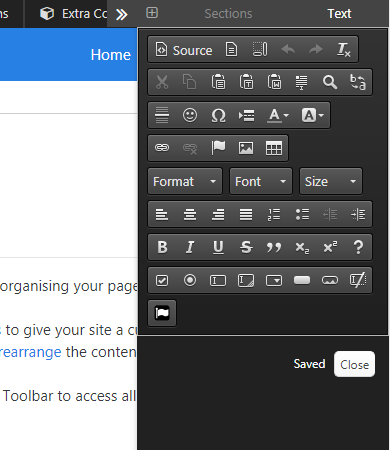
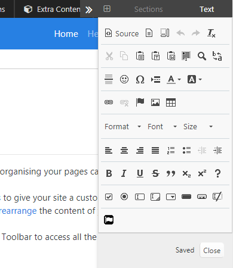
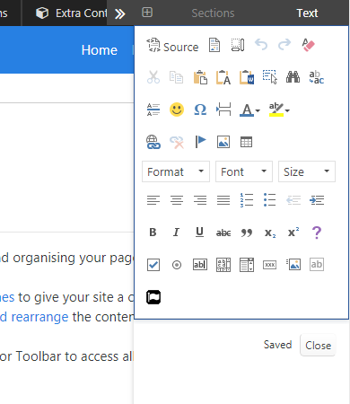
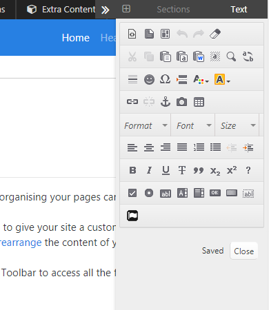
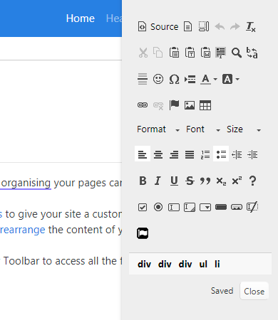

# [CKE Themes](https://github.com/mahotilo/CKE_Themes) - choose a theme for CKEditor in Typesetter CMS

## About
This addon for the Typesetter CMS allows you to
* change the default theme of CKEditor 4 to one from https://ckeditor.com/cke4/addons/skins
* show bottom CKEditor 4 bar with a list of HTML element names in the current cursor position

See also [Typesetter Home](http://www.typesettercms.com), [Typesetter on GitHub](https://github.com/Typesetter/Typesetter)

## Current Version 
3.0

## Requirements
* Typesetter CMS 5.2+

## Manual Installation
1. Download the [master ZIP archive](https://github.com/mahotilo/CKE_Themes/archive/master.zip)
2. Upload the extracted folder 'CKE_Themes-master' to your server into the /addons directory
3. Install using Typesetter's Admin Toolbox &rarr; Plugins &rarr; Manage &rarr; Available &rarr; CKE_Themes

## License
GPL 2, for bundled thirdparty components see the respective subdirectories.

## Available themes
**All themes belongs to their authors!**

* bootstrapck
* flat
* icy_orange
* kama
* minimalist
* moono
* moono-dark
* moono-lisa-M
* moono_blue
* moonocolor
* office2013
* silver

## Demo
### Theme 'icy_orange'

### Theme 'kama'

### Theme 'moono-dark'

### Theme 'moono-lisa-M'

### Theme 'office2013'

### Theme 'silver'

### Bottom bar on

